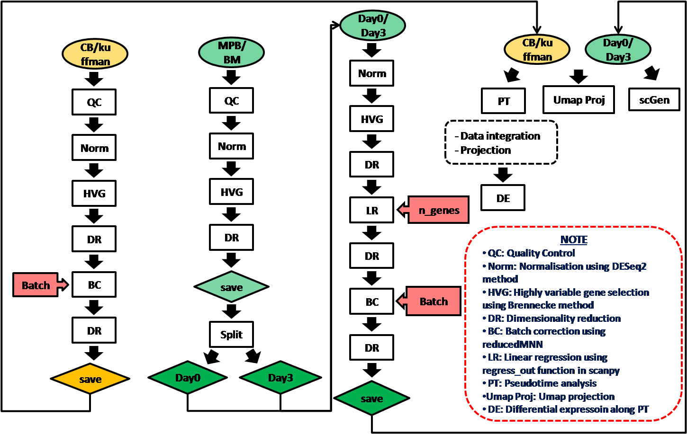

# GSK_analysis
### Xiaonan Wang
### 26May2020
## Summary: Data analysis of the GSK project

## Introduction 
The analysis was done following the strategy below:

Two reference datasets were used for data projection:
  1. Cord blood dataset (Unpublished)
  2. Kuffman dataset (Unpublished)

## Notebooks
This folder contains all jupyter notebooks that were used for the data analysis. To run the notebooks, the Smart-Seq2 preprocessng package would need to be installed first as

    pip install smqpp
  
The analysis include:
  - <ins>**[CBdata_all](https://github.com/SharonWang/GSK_analysis/blob/master/Notebooks/CBdata_all.ipynb)**</ins>: Analysis of Cord blood data to generate visualisation layouts as references for projection.
  - <ins>**[Kuffman_all](https://github.com/SharonWang/GSK_analysis/blob/master/Notebooks/Kuffman_all.ipynb)**</ins>: Analysis of Kuffman data to generate visualisation layouts as references for projection of 0hr data.
  - <ins>**[MPB1234_all](https://github.com/SharonWang/GSK_analysis/blob/master/Notebooks/MPB1234_all.ipynb)**</ins>: Analysis of all MPB cells together, for better batch correction, data was split by days.
  - <ins>**[MPB_scGen](https://github.com/SharonWang/GSK_analysis/blob/master/Notebooks/MPB_scGen.ipynb)**</ins>: Batch correction and prediction of perturbation using scGen for MPB 0hr and 62 hr NT and GFP+ cells.
  - <ins>**[MPB1234_Day0](https://github.com/SharonWang/GSK_analysis/blob/master/Notebooks/MPB1234_Day0.ipynb)**</ins>: Analysis of MPB 0hr cells
  - <ins>**[MPB1234_Day3](https://github.com/SharonWang/GSK_analysis/blob/master/Notebooks/MPB1234_Day3.ipynb)**</ins>: Analysis of MPB 62hr cells
  - <ins>**[BM789_all](https://github.com/SharonWang/GSK_analysis/blob/master/Notebooks/BM789_all.ipynb)**</ins>: Analylsis of all BM cells together, for better batch correction, data was split by days
  - <ins>**[BM_scGen](https://github.com/SharonWang/GSK_analysis/blob/master/Notebooks/BM_scGen.ipynb)**</ins>: Batch correction and prediction of perturbation using scGen for BM 0hr and 62 hr NT and GFP+ cells.
  - <ins>**[BM789_Day0](https://github.com/SharonWang/GSK_analysis/blob/master/Notebooks/BM789_Day0.ipynb)**</ins>: Analysis of BM 0hr cells
  - <ins>**[BM789_Day3](https://github.com/SharonWang/GSK_analysis/blob/master/Notebooks/BM789_Day3.ipynb)**</ins>: Analysis of BM 62hr cells
